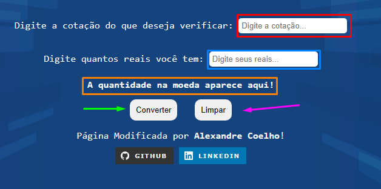

<h1 align="center"> Imersão Dev 6 </h1>

  
   
   
  

 

 <strong>Evento sensacional que consegue fazer qualquer um entender como é o mundo do desenvolvimento!</strong> 

   

## Visão Geral

Projeto realizado enquanto assistia a aula 01 da Imersão Dev 6 e posteriormente modificado por mim.

Enquanto este ReadMe está sendo escrito, a aula ainda está liberada. Pode ser acessada através deste link: <a href="https://imersao.dev/aulas/aula01-conversor-moedas
">Imersão Dev 6 - Aula 01</a>.

## Modificações

- Tive interesse em tornar o mais dinâmico a atribuição de valor e invés de usar Alerts ou Prompts eu resolvi usar inputs.

- Assim, adicionei inputs que solicitam: a cotação e a quantidade em reais. Para exibição de valor, foi usado um paragrafo, que é modificado pelo JavaScript.

- Os botões converter e limpar também foram adicionados, para que seja decidido quando ocorrerá a conversão e limpar todos os valores já existentes.

## Como executar?

  

  

- Na caixa **vermelha** deve ser inserido a cotação da moeda que deseja verificar. Observação: é que deve-se usar "." invés de ",". Exemplo de valor aceito: **5.12**. Que, inclusive, é a cotação do dolar, no momento que o ReadMe está escrito.

- Na caixa **azul** deve ser inserido a quantidade em reais que você deseja converter. Exemplo de valor aceito: **100**.

- Na caixa **laranja** irá ser exibido o valor do cálculo ( **reais/cotação** ) aproximado com duas casas decimais. Exemplo de resultado: **19.54**.

- A seta **verde** aponta para o botão "Converter". Ao ser pressionado uma função é chamada no JavaScript, onde ela irá realizar os cálculos e exibir o resutado na caixa laranja. 

- A seta **rosa** aponta para o botão "Limpar". Ao ser pressionado uma função é chamada no JavaScipt, onde ela irá atribuir o valor padrão nos inputs e no paragrafo.

- **Observação:** Caso pressionar o botaõ "Converter" inserindo valor somente em uma input ou não inserindo em nenhuma, irá ser exibido na caixa laranja: "Preencha ambos campos!".

Curioso? A seguir, link para acessar o site: <a href="https://coelhoalexandre.github.io/imersao-dev-6-alura/aula01/" target="_blank">Conversor de Moedas</a>

## Instrutores

### Paulo Silveira (CEO da Alura)

### Rafaella Ballerini (Instrutora Front-end da Alura)

### Guilherme Lima (Instrutor da Imersão Dev da Alura)

## Autor

Oi, eu sou Alexandre Coelho! Sou autor deste ReadMe e estudante de Desenvolvimento Web. Aqui estão os meus principais links para você dar uma olhada no que mais interessa-lo.

<a href = "https://www.frontendmentor.io/profile/coelhoalexandre" target="_blank">

  
